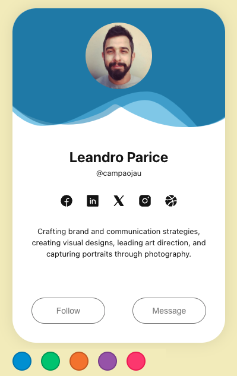

# Frontend Challenge

For study purposes, I took advantage of an Instagram post [@coding*dev*](https://www.instagram.com/coding_dev_)
Called ["Practice Frontend with these Challenges"](https://www.instagram.com/p/C94inT1yL4X/?utm_source=ig_web_copy_link&igsh=MzRlODBiNWFlZA==).
The idea is to reproduce the frontend of each image shared in the post, and as I am studying ReactJS, bring to life the elements that indicate some application in real life.
As I don't have access to any Figma or open layout files, everything visual was based on the posted image.

## 1) Profile Card

I applied color buttons to simulate the template's color change. I used SVG to animate and change colors depending on the selected button.

https://leandroparice-frontend-challenge.netlify.app

- SVG Animations
- useState
- Flex grid
- SASS
- Send props between components

  

